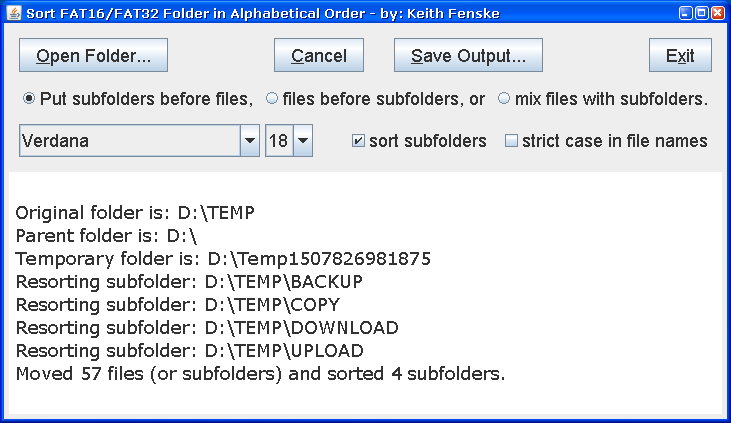

### Sort FAT Folder (Java)

by: Keith Fenske, https://kwfenske.github.io/

SortFatFolder is a Java 1.4 application to sort the directory entries for a
FAT16 or FAT32 file folder. Unlike newer file systems (NTFS), the FAT file
system does not keep directories in alphabetical order. This is hidden from the
user by most graphical interfaces, but becomes important on some types of
distribution media, e.g., USB thumb drives.

A new folder is created, in the same parent folder as a user's given folder,
and entries (files and subfolders) are moved to the new folder, one at a time,
in the desired order. The old folder, which will now be empty, is deleted. The
new folder is renamed the same as the old folder, and will likely be out of
order in the parent folder. (There are limits on how much cleaning can be done,
even manually.) DO NOT USE THIS PROGRAM ON SYSTEM FOLDERS. The only safe
folders are those you create with your own files and no hidden or system files.
The program has no purpose on any file system that maintains an internal sorted
order.

Please note that SortFatFolder is unreliable and will stop suddenly upon
finding an open or locked file, an open folder, maybe a recently open folder,
or your anti-virus or system software is unprepared for rapid changes to the
file directory. Newer versions of Windows seem worse; the program worked well
on Windows XP. Think of it as a mad squirrel in winter, and if you can tame it,
go ahead. Download the source code, make your changes, and recompile. Don't
complain when you get bitten. Squirrels are wild animals.

Download the ZIP file here: https://kwfenske.github.io/sort-fat-folder-java.zip

Released under the terms and conditions of the Apache License (version 2.0 or
later) and/or the GNU General Public License (GPL, version 2 or later).

